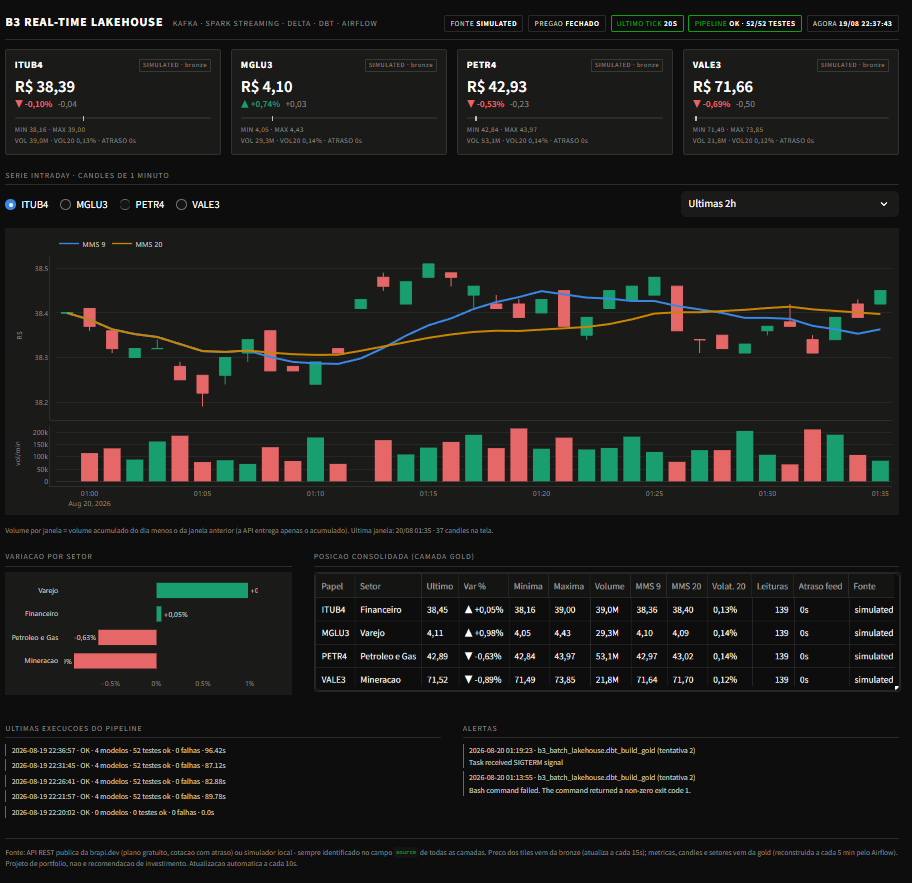
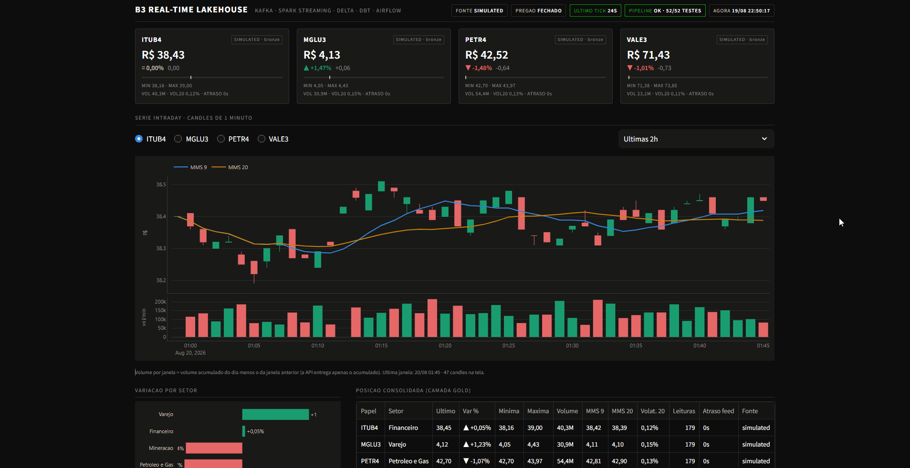
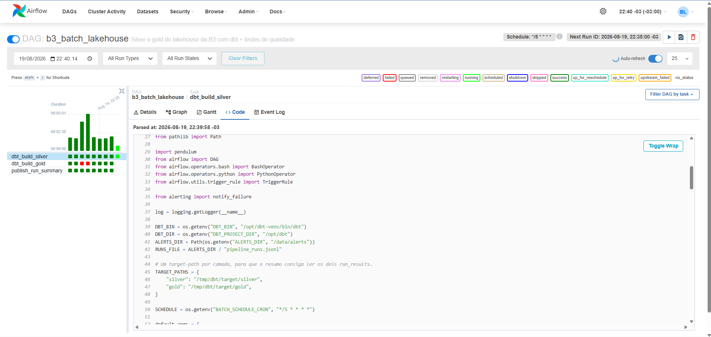
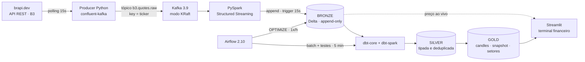

# B3 Real-Time Lakehouse

Pipeline de dados de ponta a ponta sobre cotações da **bolsa brasileira (B3)**: ingestão em
streaming, lakehouse em Delta Lake, transformação com dbt, testes de qualidade, orquestração
com Airflow e um dashboard com cara de terminal financeiro. Tudo em ferramentas gratuitas,
tudo em containers, **sobe com um comando**.


```bash
git clone https://github.com/MateusSouza74/b3-realtime-lakehouse.git
cd b3-realtime-lakehouse
docker compose up -d --build
```

| Serviço | URL | Credencial |
|---|---|---|
| Dashboard (terminal financeiro) | http://localhost:8501 | — |
| Airflow | http://localhost:8080 | `admin` / `admin` |
| Spark UI (query de streaming) | http://localhost:4040 | — |

---

## Sumário

- [O que este projeto demonstra](#o-que-este-projeto-demonstra)
- [Dashboard](#dashboard)
- [Arquitetura](#arquitetura)
- [A limitação real que define o desenho](#a-limitação-real-que-define-o-desenho)
- [Stack e por que cada peça está aqui](#stack-e-por-que-cada-peça-está-aqui)
- [Instalação e execução](#instalação-e-execução)
- [Os primeiros 10 minutos](#os-primeiros-10-minutos)
- [Modelo de dados](#modelo-de-dados)
- [Métricas do setor financeiro](#métricas-do-setor-financeiro)
- [Qualidade de dados](#qualidade-de-dados)
- [Orquestração e alertas](#orquestração-e-alertas)
- [Decisões de engenharia](#decisões-de-engenharia)
- [Design do dashboard](#design-do-dashboard)
- [Limitações conhecidas](#limitações-conhecidas)
- [Estrutura do repositório](#estrutura-do-repositório)
- [Comandos úteis](#comandos-úteis)
- [Troubleshooting](#troubleshooting)
- [Roadmap](#roadmap)
- [English summary](#english-summary)

---

## O que este projeto demonstra

| Competência | Onde está no código |
|---|---|
| Ingestão em streaming | [producer/src/producer.py](producer/src/producer.py) — polling, particionamento por ticker, idempotência, shutdown limpo |
| Kafka moderno (KRaft, sem Zookeeper) | [docker-compose.yml](docker-compose.yml) — broker + controller no mesmo nó, tópico criado explicitamente |
| Spark Structured Streaming | [spark/jobs/bronze_stream.py](spark/jobs/bronze_stream.py) — checkpoint, `failOnDataLoss`, schema explícito, bootstrap idempotente da tabela |
| Lakehouse em Delta Lake | bronze/silver/gold em Delta, `MERGE` incremental, `OPTIMIZE` agendado |
| Modelagem com dbt | [dbt/models/](dbt/models/) — source, incremental merge, seeds, macros, testes genéricos próprios |
| Qualidade de dados | 50+ testes: `not_null`, `unique`, `accepted_values`, `relationships`, faixas de preço e 3 testes singulares |
| Orquestração | [airflow/dags/](airflow/dags/) — DAG batch, DAG de manutenção, alertas por callback, resumo via `run_results.json` |
| Observabilidade de pipeline | teste de frescor da bronze, `feed_delay_seconds`, painel de execuções e alertas no dashboard |
| Domínio financeiro | OHLCV, volume por janela a partir de acumulado, médias móveis, volatilidade, faixa do dia, performance setorial |

---

## Dashboard

> **Substitua os arquivos abaixo pelos seus prints.** Veja [como gerar](#gerando-os-prints-e-o-gif).







---

## Arquitetura



O dashboard lê **duas linhas do tempo diferentes**, e isso está rotulado na tela:

- **preço ao vivo** vem da bronze, que atualiza a cada 15s junto com o streaming;
- **métricas, candles e setores** vêm da gold, reconstruída a cada 5 min pelo Airflow.

É uma arquitetura lambda simplificada. Fingir que a gold é tempo real seria mais bonito e menos
verdadeiro.

---

## A limitação real que define o desenho

**A B3 não oferece feed WebSocket gratuito de tempo real.** Dado real-time de bolsa é produto
pago — quem quer tick a tick assina o próprio Market Data da B3 ou um vendor. Então o streaming
aqui é implementado como **polling em alta frequência** (15s), e cada leitura vira um evento no
Kafka.

Do ponto de vista do resto da arquitetura, não muda nada: Kafka → Spark Structured Streaming →
Delta é exatamente o mesmo desenho de um cenário com feed real de bolsa. O que muda é só a
origem dos eventos — trocar o producer por um consumidor de FIX/WebSocket não exige tocar em
nenhuma outra camada.

E os números da API gratuita, medidos antes de escrever uma linha de código:

| Plano brapi.dev | Requisições/mês | Tickers por chamada | Atraso |
|---|---|---|---|
| **Free** | 15.000 | 1 | ~30 min |
| Startup | 150.000 | 10 | ~15 min |
| Pro | 500.000 | 20 | ~5 min |

Polling de 15s em 4 tickers, com 1 ticker por chamada, dá **~690.000 requisições/mês**. Isso
estouraria a cota do plano free em cerca de duas horas.

O que viabiliza o projeto: **PETR4, VALE3, ITUB4 e MGLU3 estão no sandbox da brapi, acessíveis
sem token**. São exatamente os tickers padrão daqui. Com um token do plano Free, ajuste
`POLL_INTERVAL_SECONDS` para 180s ou mais.

### Duas consequências tratadas de forma explícita

**1. O dado gratuito é atrasado.** Em vez de esconder, o pipeline **mede**: cada linha carrega
`feed_delay_seconds = ingestion_ts - quote_ts`, e o dashboard mostra esse atraso. Saber o quanto
o dado está velho é requisito de qualquer mesa; ignorar isso é o erro.

**2. Fora do pregão, o preço congela.** A B3 opera 10h–18h em dias úteis. Fora disso a API
devolve o mesmo valor para sempre, e um dashboard "tempo real" fica morto. Por isso existe
`SOURCE_MODE`:

| Modo | Comportamento |
|---|---|
| `brapi` | sempre a API real |
| `simulated` | random walk local, semeado com os preços reais do último boot |
| `auto` (padrão) | brapi durante o pregão, simulado fora dele |

**Todo evento carrega o campo `source`** (`brapi` ou `simulated`), propagado até a gold, exibido
no dashboard e coberto por um teste `accepted_values`. Dado real e dado simulado nunca se
confundem em nenhuma camada — que é o mesmo cuidado de proveniência que se cobra em pipeline de
produção.

---

## Stack e por que cada peça está aqui

| Componente | Versão | Por que |
|---|---|---|
| **Kafka** | 3.9 (KRaft) | Desacopla produção de consumo. Modo KRaft dispensa Zookeeper — é o padrão atual, Zookeeper foi removido no Kafka 4. |
| **PySpark Structured Streaming** | 3.5.3 | Micro-batch com checkpoint e semântica exactly-once na escrita Delta. É o motor de streaming das plataformas de dados de banco. |
| **Delta Lake** | 3.2.1 | ACID sobre arquivos, time travel, `MERGE`, `OPTIMIZE`. Leitura e escrita concorrentes por processos diferentes (Spark escreve, dbt lê) sem lock global. |
| **dbt-core + dbt-spark** | 1.9 | Transformação versionada, testável e documentada. O adapter Spark mantém a mesma linguagem de um projeto Databricks. |
| **Airflow** | 2.10.5 | Orquestração, retry, alerta. Versão que de fato roda em produção na maioria das empresas hoje. |
| **Streamlit + Plotly** | 1.40 / 5.24 | Dashboard em Python puro, sem servidor de BI. Lê Delta via `delta-rs` — nenhuma JVM na camada de apresentação. |
| **Docker Compose** | — | Seis serviços, um comando, zero instalação na máquina do avaliador. |

Escolhas que **não** entraram, de propósito: Zookeeper (obsoleto), Hive Metastore em container
separado (Derby embutido resolve local), Spark master/worker (`local[2]` é suficiente e economiza
~1,5 GB de RAM), Postgres para o Airflow (SQLite basta para duas DAGs) e Grafana (exigiria um
datasource intermediário só para ler Delta).

---

## Instalação e execução

### Pré-requisitos

- **Docker Desktop** (ou Docker Engine) com Compose v2
- **6 GB de RAM** disponíveis para os containers
- ~4 GB de disco para as imagens
- Nenhum token, nenhuma conta, nenhum cartão de crédito

### Subindo

```bash
git clone https://github.com/MateusSouza74/b3-realtime-lakehouse.git
cd b3-realtime-lakehouse

# Opcional: só se quiser customizar tickers, token ou intervalos
cp .env.example .env

docker compose up -d --build
```

O primeiro build baixa Spark, Airflow, dbt e os jars do Delta/Kafka: **de 5 a 12 minutos**
dependendo da conexão. Depois disso, `docker compose up -d` sobe em segundos.

### Acompanhando a subida

```bash
docker compose ps                              # todos os serviços de pé?
docker compose logs -f producer                # 1 linha por ciclo de polling
docker compose logs -f spark-streaming         # 1 linha por micro-batch
```

O producer loga assim:

```
ciclo=12 fonte=brapi publicados=4/4 total=48 req_brapi=48 elapsed=0.61s
```

E o streaming assim:

```
batch=7 eventos=16 acumulado=112 taxa=1.07 ev/s
```

### Derrubando

```bash
docker compose down          # para tudo, preserva o lakehouse
docker compose down -v       # apaga também os dados (reset completo)
```

---

## Os primeiros 10 minutos

| Quando | O que acontece | Onde ver |
|---|---|---|
| ~30s | Kafka saudável, tópico `b3.quotes.raw` criado com 3 partições | `docker compose logs producer` |
| ~1 min | Primeiro micro-batch grava a bronze em Delta | http://localhost:4040 |
| ~1 min | Dashboard já mostra preço ao vivo (leitura direta da bronze) | http://localhost:8501 |
| até 5 min | Primeira execução da DAG `b3_batch_lakehouse`: silver, gold e testes | http://localhost:8080 |
| depois de 5 min | Tiles, candles, setores e painel de execuções preenchidos | http://localhost:8501 |
| minuto 7 de cada hora | `OPTIMIZE` compacta os arquivos pequenos do streaming | DAG `b3_lakehouse_maintenance` |

> A **primeira** execução da DAG pode falhar no teste `assert_bronze_stream_is_fresh` se a bronze
> ainda não tiver recebido evento. Isso é o alerta funcionando, não um bug — a execução seguinte
> passa. Se quiser evitar, espere ~2 minutos antes de abrir o Airflow.

---

## Modelo de dados

### bronze — `bronze.quotes`

Escrita pelo **Spark**, não pelo dbt. Append-only, sem regra de negócio, particionada por
`ingestion_date`. Guarda o payload como chegou, mais os metadados de Kafka (`kafka_partition`,
`kafka_offset`) e de processamento — é a camada de auditoria: qualquer linha da gold pode ser
rastreada até o evento original.

O dbt a declara como `source` e a registra como tabela Delta externa via `on-run-start`.

### silver — `silver_quotes`

Grão: **uma linha por (ticker, horário da cotação na origem)**.

O ponto interessante: o polling roda a cada 15s, mas o feed gratuito atualiza a cada ~30 min.
Logo, várias leituras consecutivas devolvem **exatamente a mesma cotação**. A bronze guarda
todas (auditoria); a silver deduplica por chave natural e guarda a verdade.

Implementação: `incremental` + `incremental_strategy='merge'` com `unique_key=['ticker','quote_ts']`,
janela de reprocesso de 10 minutos para absorver evento atrasado, e `row_number()` antes do merge
— obrigatório, porque `MERGE` do Delta falha se a fonte tiver mais de uma linha por chave.

### gold

| Modelo | Grão | Serve para |
|---|---|---|
| `gold_intraday_candles` | ticker × minuto | série histórica intraday, candles OHLCV, médias móveis, volatilidade |
| `gold_ticker_snapshot` | ticker | tiles do dashboard: último preço, variação, faixa do dia, volume, atraso do feed |
| `gold_sector_performance` | setor | leitura setorial, usando o seed `dim_tickers` |

O dashboard **não calcula nada**. Se uma métrica está errada, o bug está no dbt — e existe um
teste para pegá-lo.

---

## Métricas do setor financeiro

| Métrica | Como é calculada | Nuance de domínio |
|---|---|---|
| **Variação %** | `(preço / fechamento_anterior - 1) × 100` | Recalculada em casa, não copiada do campo da API |
| **Candle OHLC 1 min** | `min_by`/`max_by` por `quote_ts`, `min`/`max` de preço | Abertura e fechamento são o **primeiro e o último por horário**, não o menor e o maior |
| **Volume por janela** | `volume_acumulado - volume_acumulado_anterior`, com piso em zero | A API entrega volume **acumulado do dia**; usar direto num gráfico de barras seria errado |
| **Média móvel 9 e 20** | `avg(close) over (rows between N preceding and current row)` | Particionada por `(ticker, trading_date)`: a média nunca atravessa o fechamento de um pregão para o outro |
| **Volatilidade 20** | desvio padrão dos retornos de 1 min nas últimas 20 janelas, em % | Não anualizada de propósito: para leitura intraday, anualizar só adiciona um fator constante |
| **Posição na faixa do dia** | `(preço - mínima) / (máxima - mínima) × 100` | 0% = na mínima, 100% = na máxima; leitura clássica de mesa |
| **Atraso do feed** | `ingestion_ts - quote_ts` | Atraso da **fonte** |
| **Idade do último tick** | `now() - ingestion_ts` | Saúde do **pipeline**. Duas coisas diferentes, as duas importam |

---

## Qualidade de dados

Os testes rodam dentro do `dbt build`, na mesma sessão Spark dos modelos e respeitando a ordem do
grafo: **se a silver falha no teste, a gold não começa**.

### Testes nativos

- `not_null` nas chaves e nas colunas de preço de todas as camadas
- `unique` em `gold_ticker_snapshot.ticker` e `gold_sector_performance.sector`
- `accepted_values` em `source` (`brapi` | `simulated`) nas três camadas
- `relationships` de `ticker` contra o seed `dim_tickers` — **contrato de dado**: ticker novo no
  stream sem cadastro na referência quebra o build de propósito

### Testes genéricos escritos para o projeto

| Teste | Regra |
|---|---|
| [`between`](dbt/macros/generic_tests/between.sql) | preço entre R$ 0,01 e R$ 5.000; variação diária dentro de ±30%; volume não negativo; posição na faixa do dia entre 0 e 100 |
| [`unique_combination_of_columns`](dbt/macros/generic_tests/unique_combination_of_columns.sql) | `(ticker, quote_ts)` único na silver — a prova de que a deduplicação funcionou |

O limite de ±30% não é arbitrário: a B3 aciona circuit breaker em -10%, então variação diária de
±30% num papel líquido do IBOV é implausível e indica erro de dado, não movimento de mercado.

### Testes singulares

| Teste | Pega |
|---|---|
| [`assert_bronze_stream_is_fresh`](dbt/tests/assert_bronze_stream_is_fresh.sql) | pipeline parado: producer, Kafka ou streaming caídos há mais de 20 min |
| [`assert_candles_ohlc_coherent`](dbt/tests/assert_candles_ohlc_coherent.sql) | candle incoerente (máxima < fechamento, mínima > abertura…) antes de o gráfico mentir |
| [`assert_no_future_quotes`](dbt/tests/assert_no_future_quotes.sql) | erro de fuso horário entre API (UTC), producer e Spark (America/Sao_Paulo) |

O último merece destaque: erro de timezone é uma das falhas mais silenciosas em pipeline
financeiro. O dado parece certo, mas o candle cai na janela errada.

---

## Orquestração e alertas

### DAG `b3_batch_lakehouse` — a cada 5 minutos

```
dbt_build_silver  →  dbt_build_gold  →  publish_run_summary
```

- **`dbt_build_silver`**: `dbt build --select source:bronze dim_tickers silver_quotes`.
  Inclui os testes da bronze, entre eles o alarme de pipeline parado.
- **`dbt_build_gold`**: `dbt build --select tag:gold`.
- **`publish_run_summary`**: lê o `run_results.json` de cada camada e publica quantos modelos
  rodaram, quantos testes passaram e quanto tempo levou. Roda com `trigger_rule=ALL_DONE` —
  quando um teste falha, o resumo é ainda mais necessário. É o mesmo artefato que ferramentas
  de observabilidade de dados consomem.

### DAG `b3_lakehouse_maintenance` — a cada hora

`OPTIMIZE` nas tabelas Delta. Streaming com trigger de 15s cria um arquivo Parquet novo por
micro-batch: em 8h de pregão são ~2.000 arquivos por partição, o clássico problema de *small
files*. `OPTIMIZE` compacta, e é seguro rodar concorrente com o append do streaming —
compactação não altera dados, e o controle de concorrência otimista do Delta resolve.

### Alertas

`on_failure_callback` em todas as tasks ([airflow/dags/alerting.py](airflow/dags/alerting.py)):

1. grava o alerta em `/data/alerts/alerts.jsonl`;
2. loga no Airflow com o `log_url` da task;
3. se `ALERT_WEBHOOK_URL` estiver definido, manda para Slack ou Discord.

Sem SMTP de propósito: e-mail exige configuração externa e não roda "de primeira" na máquina de
quem clona o repositório. O **dashboard lê o `alerts.jsonl`** e mostra o painel de alertas — o
ciclo fecha dentro do próprio projeto.

---

## Decisões de engenharia

As perguntas que um tech lead faria numa entrevista sobre este repositório.

**Por que dbt-spark com `method: session` e não um Spark Thrift Server?**
Um container a menos, sem PyHive/SASL no caminho, e um único processo escrevendo no metastore
Derby por vez. O custo é ~20s de JVM por invocação do dbt — por isso o `dbt build` roda modelo
**e** teste na mesma sessão, em vez de `dbt run` + `dbt test` separados, que dobrariam esse custo
sem ganho nenhum.

**Por que o dbt vive num virtualenv separado dentro da imagem do Airflow?**
`dbt-core` e Airflow disputam `jinja2`, `protobuf` e `pydantic`. Isolar em `/opt/dbt-venv` elimina
a briga de dependências mais comum de quem roda dbt dentro do Airflow. O `PATH` do Airflow não é
alterado; as DAGs chamam o binário por caminho absoluto.

**Por que `SequentialExecutor`?**
Escrita local em Delta e metastore Derby embutido não ganham nada com paralelismo, e ganham risco
de contenção. Aqui a serialização é uma garantia, não uma limitação — e o job de streaming grava
**por caminho**, sem tocar no metastore, justamente para não disputar o lock do Derby.

**Por que os jars do Delta e do Kafka são baixados no build?**
`--packages` resolve dependências via Ivy em *runtime*: precisa de rede a cada start e é a causa
clássica de "funciona na minha máquina". Baixar no `docker build` deixa a imagem determinística.

**Por que Kafka sem volume?**
Aqui o Kafka é **transporte**, não storage. A camada durável é a tabela Delta bronze, com
retenção de 24h no tópico. Um volume daria a falsa impressão de que o Kafka é a fonte da verdade.

**Por que os dois containers de Spark rodam com uid 50000?**
Porque escrevem na **mesma** tabela Delta: o streaming faz append, o Airflow roda `OPTIMIZE`.
Uids diferentes gerariam arquivos que o outro processo não consegue reescrever. O serviço
`init-lake` prepara os diretórios com o dono correto antes de qualquer coisa subir.

**Por que a bronze é escrita pelo Spark e não pelo dbt?**
Porque é aí que fica a fronteira entre streaming e batch. O dbt é excelente em SQL sobre dado em
repouso; ele não deve gerenciar checkpoint de streaming.

---

## Design do dashboard

O padrão de terminal financeiro é verde para alta e vermelho para baixa. Rodei a validação de
acessibilidade da paleta antes de escrever o gráfico, e **o par verde/vermelho falhou**:

```
#0ca30c ↔ #d03b3b   ΔE 4.1 (deuteranopia)   → FALHA (piso 8)
#199e70 ↔ #e66767   ΔE 6.5 (protanopia)     → passa, com codificação secundária
```

Então: aqua para alta, salmão para baixa, e **a direção nunca depende só da cor** — sempre
acompanha seta (▲/▼) e sinal explícito, nos tiles e na tabela. As médias móveis usam azul e
amarelo (ΔE 27,4), bem separadas do par de polaridade.

Outras decisões: preço e volume em **subplots empilhados**, nunca eixo duplo; grid e eixos
recessivos; números com `tabular-nums` para alinhar coluna; e a tabela consolidada existe como
via de acesso alternativa ao gráfico.

---

## Limitações conhecidas

Ficam aqui porque um portfólio sem esta seção é propaganda, não engenharia.

1. **O dado gratuito é atrasado (~30 min no plano free).** O pipeline mede e exibe esse atraso,
   mas não o elimina. Feed real-time de bolsa é pago.
2. **Modo simulado é simulação.** Random walk geométrico semeado com preços reais. Serve para
   demonstrar a arquitetura 24/7; não modela microestrutura de mercado, liquidez ou book.
3. **Feriados da B3 não são tratados.** O calendário considera só dias úteis e o horário
   10h–18h. Feriado nacional cai no modo simulado.
4. **Airflow com SQLite + `SequentialExecutor`** é local por definição. Em produção seriam
   Postgres e Celery/Kubernetes Executor.
5. **Sem Unity Catalog nem catálogo governado.** Metastore Derby embutido resolve o escopo local;
   linhagem e permissão de coluna ficariam por conta de UC ou equivalente.
6. **Um nó de Kafka, fator de replicação 1.** Zero tolerância a falha do broker — proposital
   para caber num laptop.
7. **O volume da API é acumulado do dia**, então `volume_delta` é uma reconstrução por diferença.
   Com feed real de negócios, o volume viria por trade.

---

## Estrutura do repositório

```
b3-realtime-lakehouse/
├── docker-compose.yml           # 6 serviços, um comando
├── .env.example                 # tudo opcional: os defaults funcionam sem token
│
├── producer/                    # polling da brapi.dev -> Kafka
│   ├── Dockerfile
│   └── src/producer.py          # cliente brapi + simulador + admin do tópico
│
├── spark/                       # streaming Kafka -> Delta bronze
│   ├── Dockerfile               # pyspark + jars do Delta/Kafka baixados no build
│   ├── conf/
│   │   ├── spark-defaults.conf  # Delta, fuso, umask, UI
│   │   └── log4j2.properties    # logs legíveis no docker compose logs
│   └── jobs/bronze_stream.py
│
├── dbt/                         # transformação silver/gold + testes
│   ├── dbt_project.yml          # hooks que registram a bronze, vars das regras
│   ├── profiles.yml             # dbt-spark, method=session
│   ├── seeds/dim_tickers.csv    # dado de referência: setor e índice
│   ├── macros/
│   │   ├── generate_schema_name.sql
│   │   ├── optimize_lakehouse.sql
│   │   └── generic_tests/       # between, unique_combination_of_columns
│   ├── models/
│   │   ├── bronze/_bronze_sources.yml
│   │   ├── silver/silver_quotes.sql
│   │   └── gold/gold_intraday_candles.sql, gold_ticker_snapshot.sql, gold_sector_performance.sql
│   └── tests/                   # 3 testes singulares
│
├── airflow/
│   ├── Dockerfile               # airflow + java + dbt em venv isolado
│   ├── conf/spark-defaults.conf # sessão Spark do dbt (metastore Derby)
│   ├── entrypoint.sh            # scheduler + webserver, credencial previsível
│   └── dags/
│       ├── b3_batch_lakehouse.py
│       ├── b3_lakehouse_maintenance.py
│       └── alerting.py
│
├── dashboard/
│   ├── Dockerfile
│   ├── .streamlit/config.toml   # tema escuro
│   └── app.py                   # lê Delta via delta-rs, zero JVM
│
└── docs/
    ├── images/                  # seus prints e o gif
    └── linkedin-post.md         # rascunho do post
```

---

## Comandos úteis

```bash
# --- Kafka -----------------------------------------------------------------
docker compose exec kafka /opt/kafka/bin/kafka-topics.sh \
  --bootstrap-server localhost:9092 --describe --topic b3.quotes.raw

docker compose exec kafka /opt/kafka/bin/kafka-console-consumer.sh \
  --bootstrap-server localhost:9092 --topic b3.quotes.raw --max-messages 3

# --- dbt (fora do Airflow) -------------------------------------------------
# Funciona igual em PowerShell, cmd e bash: sem variável de shell no meio.

docker compose exec airflow /opt/dbt-venv/bin/dbt build --project-dir /opt/dbt --profiles-dir /opt/dbt
docker compose exec airflow /opt/dbt-venv/bin/dbt test --project-dir /opt/dbt --profiles-dir /opt/dbt
docker compose exec airflow /opt/dbt-venv/bin/dbt source freshness --project-dir /opt/dbt --profiles-dir /opt/dbt
docker compose exec airflow /opt/dbt-venv/bin/dbt docs generate --project-dir /opt/dbt --profiles-dir /opt/dbt
docker compose exec airflow /opt/dbt-venv/bin/dbt run-operation optimize_lakehouse --project-dir /opt/dbt --profiles-dir /opt/dbt

# --- SQL ad-hoc no lakehouse ---------------------------------------------
# Macro show_query: roda qualquer SELECT e imprime o resultado no terminal.
docker compose exec airflow /opt/dbt-venv/bin/dbt run-operation show_query --project-dir /opt/dbt --profiles-dir /opt/dbt --args "{sql: 'select ticker, last_price, change_pct, source from gold.gold_ticker_snapshot order by change_pct desc'}"

# --- Inspecionar os arquivos Delta ---------------------------------------
docker compose exec airflow bash -lc "ls -la /data/delta/bronze/quotes"
docker compose exec airflow bash -lc "ls /data/delta/gold"

# --- Logs -----------------------------------------------------------------
docker compose logs -f producer spark-streaming
docker compose logs -f airflow | grep -E "dbt|ALERTA"
```

### Gerando os prints e o gif

1. Deixe rodando por ~20 minutos (com `SOURCE_MODE=simulated` você tem série cheia a qualquer
   hora, inclusive fim de semana).
2. `docs/images/dashboard.png` — dashboard em 1920×1080, aba do navegador em tela cheia.
3. `docs/images/dashboard.gif` — 10 a 15 segundos capturando dois refreshes automáticos, para
   provar que atualiza sozinho. No Windows, ScreenToGif; no macOS, Kap.
4. `docs/images/airflow-dag.png` — a grid view da DAG `b3_batch_lakehouse` com várias execuções
   verdes em sequência.

Prints com dados reais do pregão rendem mais no LinkedIn: rode entre 10h e 18h de um dia útil,
com `SOURCE_MODE=brapi`.

---

## Troubleshooting

| Sintoma | Causa e solução |
|---|---|
| Primeira execução da DAG falha em `assert_bronze_stream_is_fresh` | A bronze ainda estava vazia. É o alerta funcionando; a execução seguinte passa. |
| `dbt` falha com `Another instance of Derby may have already booted` | Duas sessões Spark disputando o metastore (ex.: um `dbt` manual durante a DAG). `docker compose restart airflow`. |
| Dashboard diz "camada gold ainda vazia" | Espere a primeira execução da DAG (até 5 min) ou dispare manualmente no Airflow. |
| Teste `relationships` falhando após trocar `TICKERS` | Comportamento esperado: adicione o ticker em `dbt/seeds/dim_tickers.csv`. É o contrato de dado. |
| Producer logando `429` | Cota da brapi estourada. Aumente `POLL_INTERVAL_SECONDS` ou use `SOURCE_MODE=simulated`. |
| Preço não muda fora do pregão | Comportamento da API. Use `SOURCE_MODE=simulated` (padrão `auto` já faz isso). |
| Airflow não abre em `:8080` | Ainda migrando o banco no primeiro start. `docker compose logs -f airflow`. |
| Containers morrendo sem log claro | RAM. Docker Desktop → Settings → Resources → 6 GB. |
| Erro de `\r` em script no Windows | Clone com o `.gitattributes` do repositório (força LF nos `.sh`). |
| Quero começar do zero | `docker compose down -v && docker compose up -d --build` |

---

## Roadmap

Ideias de continuidade, em ordem de valor:

- [ ] **Great Expectations** ou **Soda** ao lado do dbt, para comparar abordagens de qualidade
- [ ] **Deduplicação com watermark** no próprio Structured Streaming (`dropDuplicatesWithinWatermark`)
- [ ] **Detecção de anomalia** de preço em janela deslizante, publicando num tópico `b3.alerts`
- [ ] **CI no GitHub Actions**: `dbt parse` + `sqlfluff` + build das imagens em cada PR
- [ ] **Iceberg** em paralelo ao Delta, para comparar os dois formatos no mesmo pipeline
- [ ] **dbt docs** publicado no GitHub Pages
- [ ] Feed de negócios real (via corretora com API) substituindo o polling

---

## English summary

End-to-end **real-time data engineering** project on Brazilian stock exchange (B3) data, built
entirely with free tooling and running with a single `docker compose up`.

**Pipeline**: a Python producer polls the public brapi.dev REST API and publishes each reading to
**Kafka** (KRaft mode, no Zookeeper) → **PySpark Structured Streaming** appends to a **Delta Lake**
bronze table → **dbt-core** (Spark adapter) builds deduplicated silver and analytics-ready gold
layers → **Airflow** orchestrates the batch layer, data quality tests and failure alerts → a
**Streamlit** dashboard reads Delta through `delta-rs` and renders a financial-terminal view.

**Why polling instead of WebSocket**: B3 has no free real-time WebSocket feed — real-time exchange
data is a paid product. The streaming architecture (Kafka + Structured Streaming + Delta) is
identical to what a real exchange feed would use; only the producer would change.

**Financial metrics**: 1-minute OHLCV candles, per-window volume reconstructed from the API's
daily cumulative figure, 9/20-period moving averages, rolling volatility, day-range position, and
feed latency (`ingestion_ts - quote_ts`) as a first-class data quality metric.

**Data quality**: 50+ dbt tests, including two custom generic tests (plausible price ranges,
composite-key uniqueness) and three singular tests (stream freshness, OHLC coherence, timezone
sanity).

---

## Licença

[MIT](LICENSE).

> **Não é recomendação de investimento.** Projeto educacional e de portfólio. Os dados vêm da API
> pública gratuita da [brapi.dev](https://brapi.dev) (cotação com atraso) ou de um simulador
> local, sempre identificado no campo `source` de todas as camadas.
